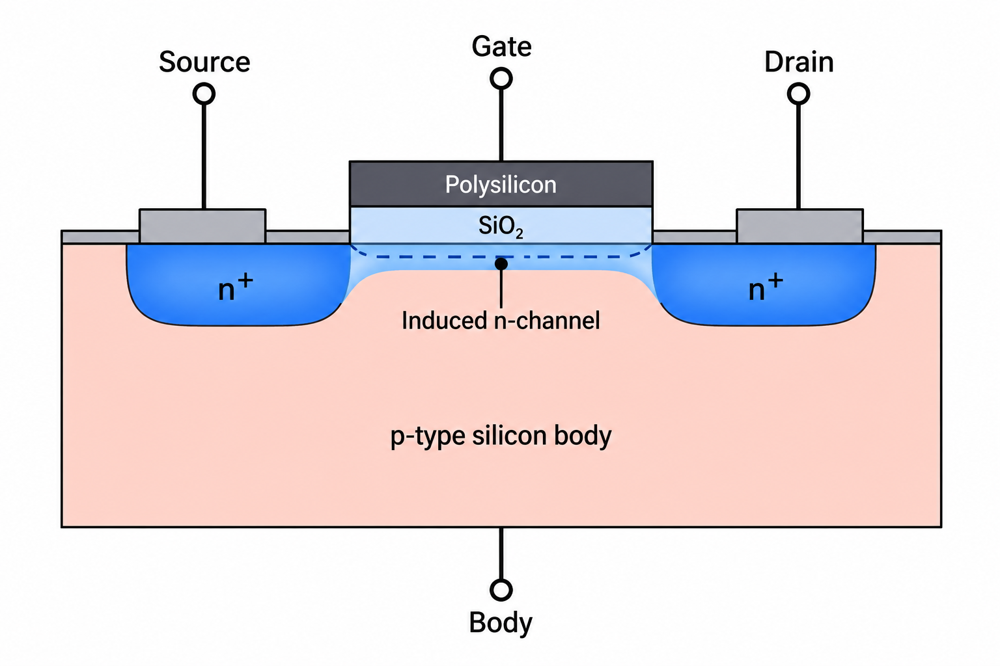

# DC Characteristics of an n-Channel MOSFET

### Two-Dimensional Semiconductor Device Simulation Using COMSOL Multiphysics® 6.2

<p align="center">

**COMSOL Multiphysics® 6.2** · **Semiconductor Module** · **Finite-Element Simulation** · **Device Physics**

</p>

<p align="center">
  
</p>

<p align="center">
  <b>Two-dimensional semiconductor simulation of an n-channel MOSFET showing carrier concentration and electrostatic potential.</b>
</p>

---

## About This Project

Transistors are the fundamental active devices behind modern electronics. They enable **switching, amplification, signal processing, memory, sensing, and computation**, forming the basis of everything from microcontrollers and communication systems to CPUs, GPUs, and embedded hardware.

Among the different transistor families, the **MOSFET (Metal–Oxide–Semiconductor Field-Effect Transistor)** is one of the most important devices in modern semiconductor technology. Its ability to control current through an electric field makes it suitable for both digital switching and analog amplification.

This project investigates the **DC characteristics of a two-dimensional n-channel MOSFET** using COMSOL Multiphysics® 6.2 and the Semiconductor Module.

Rather than treating the MOSFET only as a circuit-level component, the study examines the relationship between:

- Semiconductor doping
- Electric potential
- Carrier concentration
- Gate voltage
- Drain voltage
- Channel formation
- Pinch-off
- Drain current

The simulation is used to obtain the **transfer and output characteristics**, estimate the **threshold voltage**, visualize semiconductor behavior, and extract important small-signal parameters including **transconductance, output conductance, output resistance, and intrinsic gain**.

---

# 1. Understanding the Transistor

A **transistor** is a semiconductor device used primarily to control the flow of electrical current.

At a fundamental level, a transistor allows an electrical signal to control another electrical quantity. This makes transistors useful in two major operating roles:

- **Switching** — controlling whether current flows
- **Amplification** — producing a larger signal response from a smaller controlling signal

The operation of a transistor depends on the movement of charge carriers inside a semiconductor. The device geometry, doping concentration, electric fields, and applied voltages determine how those carriers behave.

Modern integrated circuits contain extremely large numbers of transistors working together to perform computation, memory storage, signal processing, communication, and control.

Understanding transistor physics therefore provides a foundation for understanding:

- Digital logic
- Analog circuits
- Microprocessors
- Memory
- Embedded systems
- Communication circuits
- Integrated circuits

---

# 2. From Transistor to MOSFET

A **MOSFET (Metal–Oxide–Semiconductor Field-Effect Transistor)** is a field-effect transistor in which the current flowing between the **source** and **drain** is controlled primarily by the electric field generated by the **gate**.

A MOSFET has four terminals:

| Terminal | Function |
|---|---|
| **Gate (G)** | Controls the channel through an electric field |
| **Drain (D)** | Collects carriers flowing through the channel |
| **Source (S)** | Provides carriers to the channel |
| **Body / Bulk (B)** | Semiconductor region surrounding the channel |

The gate is separated from the semiconductor by an insulating layer. This allows the gate voltage to control the semiconductor surface without requiring significant steady-state gate current.

For an **n-channel MOSFET**, applying a sufficiently positive gate voltage attracts electrons toward the semiconductor surface. Once the gate voltage becomes sufficiently high, an inversion region develops between source and drain, forming a conducting n-type channel.

<p align="center">
  
</p>

<p align="center">
  <b>Conceptual structure of an n-channel MOSFET showing the source, gate, drain, body, oxide, and induced channel.</b>
</p>

> The conceptual illustration above introduces the physical structure and operation of an n-channel MOSFET. The device investigated in this repository is the independently configured two-dimensional COMSOL simulation described in the following sections.

---

# 3. How an n-Channel MOSFET Works

The operation of an n-channel MOSFET can be understood primarily through the relationship between **gate voltage, channel formation, and drain voltage**.

## 3.1 Gate Voltage Below Threshold

When the gate voltage is insufficient to create strong inversion, a continuous conducting channel does not form between the source and drain.

Consequently, only a relatively small drain current flows under the simulated operating conditions.

---

## 3.2 Gate Voltage Above Threshold

As the gate voltage increases beyond the threshold voltage, electrons are attracted toward the semiconductor surface.

An inversion channel develops between the source and drain, providing a conducting path for electrons.

The drain current therefore increases as the gate voltage is increased.

---

## 3.3 Increasing Drain Voltage

When a drain voltage is applied, an electric field develops along the channel.

As the drain voltage increases:

1. The potential becomes non-uniform along the channel.
2. The inversion layer becomes progressively thinner toward the drain.
3. The electric field near the drain becomes stronger.
4. At sufficiently high drain voltage, the channel approaches **pinch-off** near the drain.
5. The drain current enters a region where its dependence on drain voltage becomes weaker.

This behavior produces the characteristic transition from the **linear region** to the **saturation region** of MOSFET operation.

---

# 4. Why MOSFET Characterization Matters

Characterizing a MOSFET is important because its electrical parameters determine how the device behaves when used inside larger circuits.

The key quantities investigated in this project include the following.

## Threshold Voltage — V<sub>T</sub>

The threshold voltage represents the approximate gate voltage at which strong inversion begins to develop.

It influences:

- Switching behavior
- Biasing
- Logic operation
- Operating point
- Power consumption

---

## Transconductance — g<sub>m</sub>

Transconductance describes the sensitivity of drain current to gate voltage:

$$
g_m = \frac{\partial I_D}{\partial V_G}
$$

A larger transconductance indicates stronger control of drain current through the gate voltage.

It is particularly important in analog amplifier design.

---

## Output Conductance — g<sub>d</sub>

Output conductance describes the sensitivity of drain current to drain voltage:

$$
g_d = \frac{\partial I_D}{\partial V_D}
$$

It provides information about the non-ideal dependence of drain current on drain voltage, particularly in the saturation region.

---

## Output Resistance — r<sub>d</sub>

Output resistance is approximately the inverse of output conductance:

$$
r_d \approx \frac{1}{g_d}
$$

A higher output resistance corresponds to a smaller variation in drain current for a given change in drain voltage.

---

## Intrinsic Gain

A useful small-signal measure of intrinsic voltage-gain capability is:

$$
A_v \approx \frac{g_m}{g_d}
$$

This quantity connects the transistor's gate control capability with its output resistance.

---

# 5. Project Objective

The objective of this project is to perform a detailed **two-dimensional semiconductor device simulation of an n-channel MOSFET** and connect the physical device behavior to its electrical characteristics.

The study focuses on:

- Modeling the MOSFET device structure
- Defining semiconductor doping regions
- Applying electrical boundary conditions
- Solving the semiconductor device equations
- Investigating threshold-voltage behavior
- Obtaining transfer & output characteristics
- Identifying linear and saturation behavior
- Visualizing channel formation
- Studying pinch-off near the drain
- Extracting transconductance & output conductance
- Calculating output resistance
- Estimating intrinsic gain

---

# 6. My Approach

I approached this project by focusing on **understanding the physical reason behind each simulated result rather than simply reproducing an I–V curve**.

The workflow was structured around the relationship:

```text
Device Structure
       ↓
Material Properties
       ↓
Doping Profiles
       ↓
Electrical Boundary Conditions
       ↓
Mesh Configuration
       ↓
Semiconductor Physics
       ↓
DC Simulation
       ↓
Carrier Concentration & Potential
       ↓
I–V Characteristics
       ↓
Parameter Extraction
       ↓
Independent Verification
