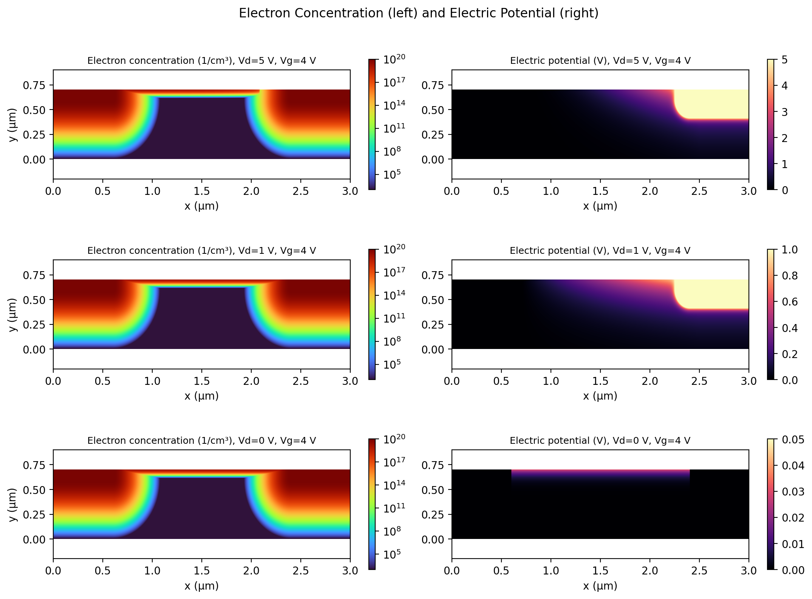
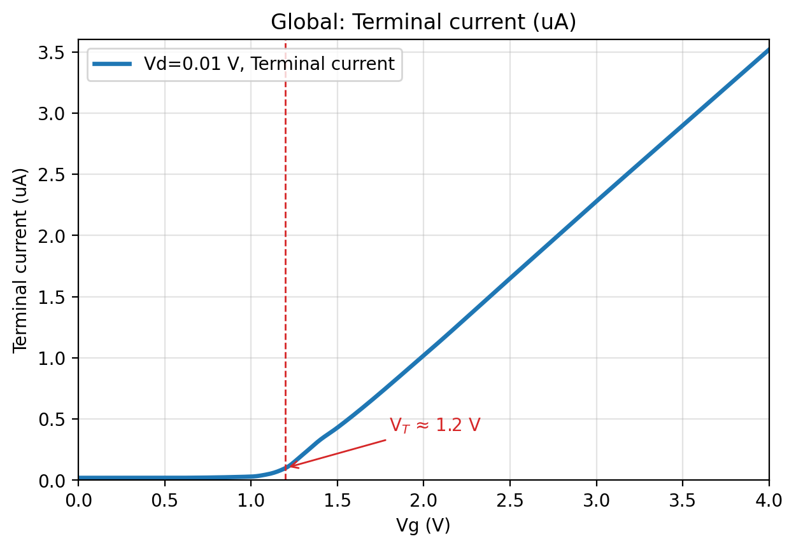
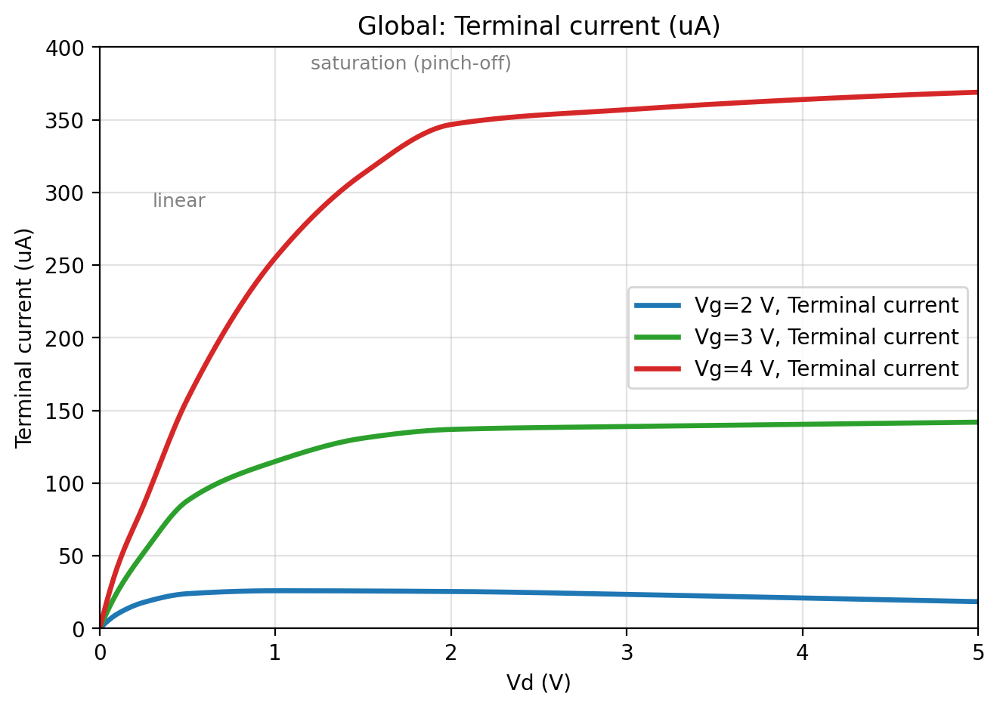
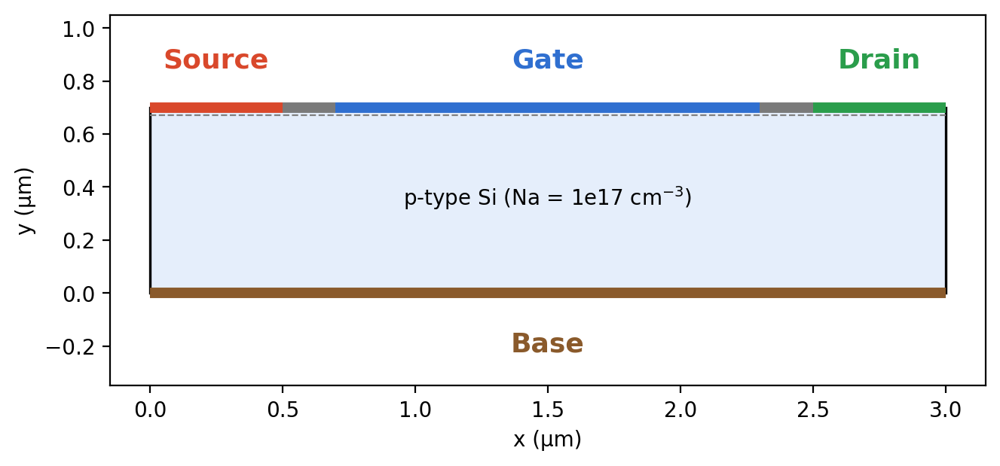
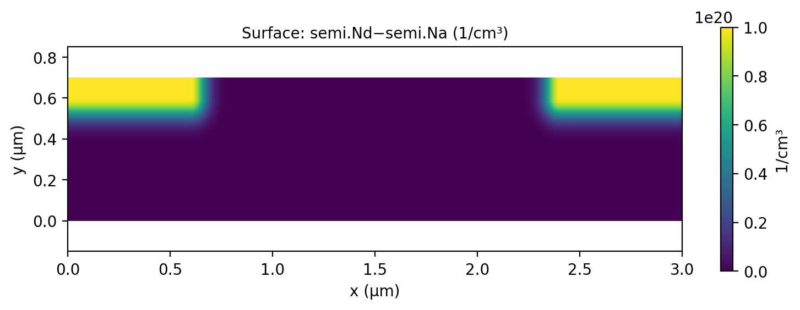
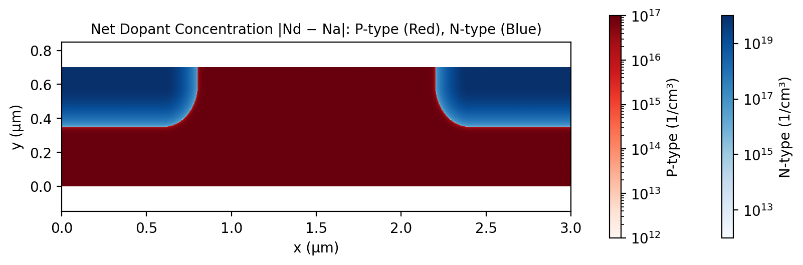

# DC Characteristics of an n-Channel MOSFET

### Two-dimensional device simulation with COMSOL Multiphysics® 6.2 (Semiconductor Module)

**COMSOL 6.2** · **Semiconductor Module** · **Simulation Study** · **MIT License**

A finite-element study of a 2D n-channel silicon MOSFET using Fermi–Dirac statistics, Jain–Roulston band-gap narrowing, and Shockley–Read–Hall (SRH) recombination. The project extracts the **threshold voltage**, evaluates the **linear, non-linear, and saturation output characteristics**, visualizes **channel formation and pinch-off**, and derives **small-signal parameters** including transconductance (g<sub>m</sub>), output conductance (g<sub>d</sub>), and output resistance (r<sub>d</sub>).


<p align="center">
  
</p>

---

## Headline Results

| Quantity | Result |
|---|---|
| Threshold voltage (simulated, V<sub>D</sub> = 10 mV) | **≈ 1.2 V** |
| Threshold voltage (analytical, reference model) | **1.18 V** |
| Saturation current, V<sub>G</sub> = 2 / 3 / 4 V | **≈ 25 / 137–142 / 347–369 µA** |
| Square-law constant K = 2·I<sub>D,sat</sub>/(V<sub>G</sub>−V<sub>T</sub>)² | **≈ 84 µA/V² (within ~7%)** |
| Output conductance, non-linear region (V<sub>G</sub> = 4 V) | **91.7 µS (r<sub>d</sub> ≈ 10.9 kΩ)** |
| Output conductance, saturation (V<sub>G</sub> = 4 V) | **≈ 7 µS (r<sub>d</sub> ≈ 135 kΩ)** |
| Saturation transconductance g<sub>m</sub> | **≈ 227 µS** |
| Intrinsic gain g<sub>m</sub>/g<sub>d</sub> | **≈ 30** |

> **Note:** The model is two-dimensional, so currents are reported per unit out-of-plane depth. Absolute µA values should therefore be interpreted qualitatively, while the observed trends and extracted parameters are used quantitatively within the scope of the model.

<table>
<tr>
<td><br><sub><b>Transfer characteristic</b> at V<sub>D</sub> = 10 mV: V<sub>T</sub> ≈ 1.2 V</sub></td>
<td><br><sub><b>Output characteristics</b> at V<sub>G</sub> = 2, 3, 4 V</sub></td>
</tr>
</table>

---

## Key Findings

1. **Threshold voltage:** The simulated transfer characteristic gives a threshold voltage of approximately **1.2 V**, consistent with the linear-extrapolation value of approximately **1.18 V** and the analytical reference value of **1.18 V**.

2. **Operating regions:** The simulation reproduces the expected linear, non-linear, and saturation behavior for the investigated gate voltages. The saturation current scales approximately with **(V<sub>G</sub> − V<sub>T</sub>)²**.

3. **Channel formation and pinch-off:** At **V<sub>D</sub> = 5 V**, the inversion layer becomes markedly thinner toward the drain end, illustrating the physical mechanism associated with current saturation. At **V<sub>D</sub> = 0 V**, the channel remains comparatively uniform.

4. **Finite output conductance:** The saturation current continues to increase slightly with drain voltage, resulting in a finite output conductance and corresponding output resistance.

---

## Device and Model

<p align="center">
  
</p>

| Item | Value |
|---|---|
| Domain | 3 µm × 0.7 µm p-type Si, N<sub>a</sub> = 10¹⁷ cm⁻³ |
| Source / drain | n⁺ Gaussian box implants, peak N<sub>d</sub> = 10²⁰ cm⁻³, d<sub>j</sub> = (0.2, 0.25) µm |
| Gate | x = 0.7–2.3 µm, length = 1.6 µm, 30 nm insulator, ε<sub>r</sub> = 4.5 |
| Contacts | Source and base grounded; drain at V<sub>D</sub>; gate at V<sub>G</sub> |
| Physics | Fermi–Dirac statistics, Jain–Roulston BGN, SRH recombination |
| Mesh | Edge mesh 0.08 µm + mapped boundary-layer mesh, growth rate = 1.05 |
| Study 1 | V<sub>D</sub> = 10 mV, V<sub>G</sub> = 0–4 V (transfer characteristic) |
| Study 2 | V<sub>D</sub> = 0–5 V at V<sub>G</sub> = 2, 3, 4 V (output characteristics) |

### COMSOL Model

The simulations were developed and analyzed using **COMSOL Multiphysics® 6.2 with the Semiconductor Module**. This repository contains the simulation methodology, model parameters, extracted results, figures, COMSOL screenshots, verification scripts, and technical documentation used for the study.

The original COMSOL `.mph` model file is **not included in this repository**. The provided documentation and reproduction guide describe the model setup, simulation workflow, parameters, and analysis used to obtain the reported results.

<table>
<tr>
<td><br><sub>Signed doping N<sub>d</sub> − N<sub>a</sub></sub></td>
<td><br><sub>Net doping: p-type / n-type, logarithmic scale</sub></td>
</tr>
</table>

Full parameter list: [`data/simulation_parameters.csv`](data/simulation_parameters.csv)

Step-by-step COMSOL reconstruction instructions: [`docs/reproduce_in_comsol.md`](docs/reproduce_in_comsol.md)

---

## Repository Structure

```text
.
├── README.md
├── LICENSE
├── CITATION.cff
│
├── report/
│   ├── MOSFET_report.pdf
│   └── MOSFET_report.docx
│
├── figures/
│   ├── 01_device_geometry_terminals.png
│   ├── 02_boundary_numbers.png
│   ├── 03_doping_model2_donor.png
│   ├── 04_doping_signed_Nd-Na.png
│   ├── 05_doping_net_pn_log.png
│   ├── 06_transfer_id_vs_vg.png
│   ├── 07_output_id_vs_vd.png
│   └── 08_electron_conc_and_potential.png
│
├── comsol_screenshots/
│   ├── COMSOL model and setup screenshots
│   └── simulation result screenshots
│
├── data/
│   ├── key_results.csv
│   └── simulation_parameters.csv
│
├── docs/
│   └── reproduce_in_comsol.md
│
└── scripts/
    └── verify_calculations.py
